# mozjpeg-rs

Pure Rust JPEG encoder based on Mozilla's [mozjpeg](https://github.com/mozilla/mozjpeg), featuring trellis quantization for optimal compression.

[](https://crates.io/crates/mozjpeg-rs)
[](https://docs.rs/mozjpeg-rs)
[](https://github.com/imazen/mozjpeg-rs/actions/workflows/ci.yml)
[](https://codecov.io/gh/imazen/mozjpeg-rs)
[](LICENSE)

## Why mozjpeg-rs?

| | mozjpeg-rs | C mozjpeg | libjpeg-turbo |
|--|---------------|-----------|---------------|
| **Language** | Pure Rust | C | C/asm |
| **Memory safety** | Compile-time guaranteed | Manual | Manual |
| **Trellis quantization** | Yes | Yes | No |
| **Build complexity** | `cargo add` | cmake + nasm + C toolchain | cmake + nasm |

**Choose mozjpeg-rs when you want:**
- Memory-safe JPEG encoding without C dependencies
- Smaller files than libjpeg-turbo (trellis quantization)
- Simple integration via Cargo

**Choose C mozjpeg when you need:**
- Smallest possible files at high quality (Q85+)
- Maximum baseline encoding speed (SIMD-optimized entropy coding)
- Established C ABI for FFI

## Compression Results vs C mozjpeg

Tested on full [Kodak](http://r0k.us/graphics/kodak/) corpus (24 images), trellis + Huffman opt, 4:2:0 subsampling.

### Max Compression Mode (`Encoder::max_compression()`)

Progressive mode with `optimize_scans=true` - each AC scan gets its own optimal Huffman table.

| Quality | Rust vs C | Notes |
|---------|-----------|-------|
| Q50 | **-0.39%** | Rust produces smaller files |
| Q60 | **-0.26%** | Rust smaller |
| Q70 | **-0.38%** | Rust smaller |
| Q75 | **-0.14%** | Rust smaller |
| Q80 | +0.17% | Near-identical |
| Q85 | +0.42% | Near-identical |
| Q90 | +0.97% | Slight gap |
| Q95 | +1.59% | |
| Q97 | +2.13% | |
| Q100 | +0.98% | |

### All Modes Comparison

| Quality | Baseline | Progressive | Max Compression |
|---------|----------|-------------|-----------------|
| Q50 | +0.15% | **-1.23%** | **-0.39%** |
| Q60 | +0.47% | **-0.70%** | **-0.26%** |
| Q70 | +0.54% | **-0.35%** | **-0.38%** |
| Q75 | +0.87% | +0.22% | **-0.14%** |
| Q80 | +1.34% | +0.90% | +0.17% |
| Q85 | +1.75% | +1.44% | +0.42% |
| Q90 | +2.73% | +2.63% | +0.97% |
| Q95 | +3.87% | +3.64% | +1.59% |
| Q97 | +5.36% | +4.90% | +2.13% |
| Q100 | +3.53% | +2.59% | +0.98% |

**Summary**:
- **Max Compression**: Rust matches or beats C at Q50-Q80, within 2.2% at all quality levels
- **Progressive**: Rust beats C at Q50-Q70, within 5% at all levels
- **Baseline**: Larger gap due to trellis quantization differences at high quality

Visual quality (SSIMULACRA2, Butteraugli) is virtually identical at all quality levels.

<picture>
  <source media="(prefers-color-scheme: dark)" srcset="benchmark/pareto_ssimulacra2.svg">
  <source media="(prefers-color-scheme: light)" srcset="benchmark/pareto_ssimulacra2.svg">
  
</picture>

## Usage

```rust
use mozjpeg_rs::{Encoder, Subsampling};

// Default: trellis quantization + Huffman optimization
let jpeg = Encoder::new()
    .quality(85)
    .encode_rgb(&pixels, width, height)?;

// Maximum compression: progressive + trellis + deringing
let jpeg = Encoder::max_compression()
    .quality(85)
    .encode_rgb(&pixels, width, height)?;

// Fastest: no optimizations (libjpeg-turbo compatible output)
let jpeg = Encoder::fastest()
    .quality(85)
    .encode_rgb(&pixels, width, height)?;

// Custom configuration
let jpeg = Encoder::new()
    .quality(75)
    .progressive(true)
    .subsampling(Subsampling::S420)
    .optimize_huffman(true)
    .encode_rgb(&pixels, width, height)?;
```

## Features

- **Trellis quantization** - Rate-distortion optimized coefficient selection (AC + DC)
- **Progressive JPEG** - Multi-scan encoding with spectral selection
- **Huffman optimization** - 2-pass encoding for optimal entropy coding
- **Overshoot deringing** - Reduces ringing artifacts at sharp edges
- **Chroma subsampling** - 4:4:4, 4:2:2, 4:2:0 modes
- **Safe Rust** - `#![deny(unsafe_code)]` with exceptions only for SIMD intrinsics

### Encoder Settings Matrix

All combinations of settings are supported and tested:

| Setting | Baseline | Progressive | Notes |
|---------|:--------:|:-----------:|-------|
| **Subsampling** | | | |
| ├─ 4:4:4 | ✅ | ✅ | No chroma subsampling |
| ├─ 4:2:2 | ✅ | ✅ | Horizontal subsampling |
| └─ 4:2:0 | ✅ | ✅ | Full subsampling (default) |
| **Trellis Quantization** | | | |
| ├─ AC trellis | ✅ | ✅ | Rate-distortion optimized AC coefficients |
| └─ DC trellis | ✅ | ✅ | Cross-block DC optimization |
| **Huffman** | | | |
| ├─ Default tables | ✅ | ✅ | Fast, slightly larger files |
| └─ Optimized tables | ✅ | ✅ | 2-pass, smaller files |
| **Progressive-only** | | | |
| └─ optimize_scans | ❌ | ✅ | Per-scan Huffman tables |
| **Other** | | | |
| ├─ Deringing | ✅ | ✅ | Reduce overshoot artifacts |
| ├─ Grayscale | ✅ | ✅ | Single-component encoding |
| └─ EOB optimization | ✅ | ✅ | Cross-block EOB runs (opt-in) |

**Presets:**
- `Encoder::new()` - Trellis (AC+DC) + Huffman optimization + Deringing
- `Encoder::max_compression()` - Above + Progressive + optimize_scans
- `Encoder::fastest()` - No optimizations (libjpeg-turbo compatible)

## Performance

Benchmarked on 512x768 image, 20 iterations, release mode:

| Configuration | Rust | C mozjpeg | Ratio |
|---------------|------|-----------|-------|
| Baseline (huffman opt) | 7.1 ms | 26.8 ms | **3.8x faster** |
| Trellis (AC + DC) | 19.7 ms | 25.3 ms | **1.3x faster** |
| Progressive + trellis | 20.0 ms | - | - |

**Note**: C mozjpeg's baseline encoding is typically faster with its hand-optimized SIMD entropy coding. The benchmark numbers above reflect mozjpeg-sys from crates.io which may not have all optimizations enabled.

### SIMD Support

mozjpeg-rs uses `multiversion` for automatic vectorization by default. Optional hand-written SIMD intrinsics are available:

```toml
[dependencies]
mozjpeg-rs = { version = "0.2", features = ["simd-intrinsics"] }
```

In benchmarks, the difference is minimal (~2%) as `multiversion` autovectorization works well for DCT and color conversion.

## Differences from C mozjpeg

mozjpeg-rs aims for compatibility with C mozjpeg but has some differences:

| Feature | mozjpeg-rs | C mozjpeg |
|---------|---------------|-----------|
| **Progressive scan script** | Simple 4-scan (or optimize_scans) | 9-scan with successive approximation |
| **optimize_scans** | Per-scan Huffman tables | Per-scan Huffman tables |
| **Trellis EOB optimization** | Available (opt-in) | Available (rarely used) |
| **Arithmetic coding** | Not implemented | Available (rarely used) |
| **Grayscale progressive** | Yes | Yes |

### Why the file size gap at high quality?

At quality levels above Q85, there's a small gap (1-3%) due to differences in the progressive scan structure:

- **C mozjpeg** uses a 9-scan successive approximation (SA) script that splits coefficient bits into coarse and fine layers
- **mozjpeg-rs** uses a 4-scan script (DC + full AC for each component) with per-scan optimal Huffman tables

With `optimize_scans=true` (enabled in `max_compression()`), mozjpeg-rs matches or beats C mozjpeg at Q50-Q80.

### Matching C mozjpeg output exactly

For exact byte-identical output to C mozjpeg, you would need to:
1. Use baseline (non-progressive) mode
2. Match all encoder settings exactly
3. Use the same quantization tables (ImageMagick tables, index 3)

The FFI comparison tests in `tests/ffi_comparison.rs` verify component-level parity.

## Development

### Running CI Locally

```bash
# Format check
cargo fmt --all -- --check

# Clippy lints
cargo clippy --workspace --all-targets -- -D warnings

# Build
cargo build --workspace

# Unit tests
cargo test --lib

# Codec comparison tests
cargo test --test codec_comparison

# FFI validation tests (requires mozjpeg-sys from crates.io)
cargo test --test ffi_validation
```

### Reproduce Benchmarks

```bash
# Fetch test corpus (Kodak images, ~15MB)
./scripts/fetch-corpus.sh

# Run full corpus comparison
cargo run --release --example full_corpus_test

# Run pareto benchmark
cargo run --release --example pareto_benchmark
```

### Test Coverage

```bash
# Install cargo-llvm-cov
cargo install cargo-llvm-cov

# Generate coverage report
cargo llvm-cov --lib --html

# Open report
open target/llvm-cov/html/index.html
```

## License

BSD-3-Clause - Same license as the original mozjpeg.

## Acknowledgments

Based on Mozilla's [mozjpeg](https://github.com/mozilla/mozjpeg), which builds on libjpeg-turbo and the Independent JPEG Group's libjpeg.

## AI-Generated Code Notice

This crate was developed with significant assistance from Claude (Anthropic). While the code has been tested against the C mozjpeg reference implementation and passes 248 tests including FFI validation, **not all code has been manually reviewed or human-audited**.

Before using in production:
- Review critical code paths for your use case
- Run your own validation against expected outputs
- Consider the encoder's test suite coverage for your specific requirements

The FFI comparison tests in `tests/ffi_comparison.rs` and `tests/ffi_validation.rs` provide confidence in correctness by comparing outputs against C mozjpeg.
