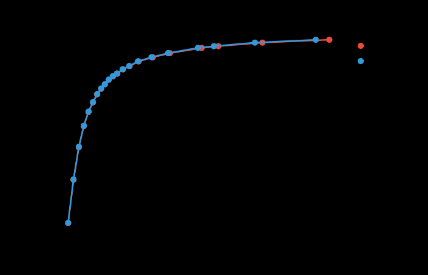

# mozjpeg-rs

Pure Rust JPEG encoder based on Mozilla's [mozjpeg](https://github.com/mozilla/mozjpeg), featuring trellis quantization for optimal compression.

[](https://crates.io/crates/mozjpeg-rs)
[](https://docs.rs/mozjpeg-rs)
[](https://github.com/imazen/mozjpeg-rs/actions/workflows/ci.yml)
[](https://codecov.io/gh/imazen/mozjpeg-rs)
[](LICENSE)

## Encoder Only

**mozjpeg-rs is a JPEG encoder only.** It does not decode JPEG files.

For decoding, use one of these excellent crates:

| Crate | Type | Notes |
|-------|------|-------|
| **[jpeg-decoder](https://crates.io/crates/jpeg-decoder)** | Pure Rust | Widely used, reliable |
| **[zune-jpeg](https://crates.io/crates/zune-jpeg)** | Pure Rust | Fast, SIMD-optimized |
| **[mozjpeg](https://crates.io/crates/mozjpeg)** | C bindings | Safe wrapper for C mozjpeg (encode + decode) |

**Note on C mozjpeg bindings:** If using the `mozjpeg` crate, be careful with parameter setting order. Several methods internally call `jpeg_set_defaults()` which silently resets previously-set values:
- `set_scan_optimization_mode()`, `set_fastest_defaults()` reset: quality, smoothing, pixel density, subsampling, Huffman settings, quantization tables
- `set_color_space()` resets: sampling factors, quantization/Huffman table assignments (e.g., 4:2:2 subsampling reverts to 4:2:0)

Call these methods *first*, then set quality, subsampling, and other options.

## Why mozjpeg-rs?

| | mozjpeg-rs | C mozjpeg | libjpeg-turbo |
|--|---------------|-----------|---------------|
| **Language** | Pure Rust | C | C/asm |
| **Memory safety** | Compile-time guaranteed | Manual | Manual |
| **Trellis quantization** | Yes | Yes | No |
| **Build complexity** | `cargo add` | cmake + nasm + C toolchain | cmake + nasm |

**Choose mozjpeg-rs when you want:**
- Memory-safe JPEG encoding without C dependencies
- Smaller files than libjpeg-turbo (trellis quantization)
- Simple integration via Cargo

**Choose C mozjpeg when you need:**
- Maximum baseline encoding speed (SIMD-optimized entropy coding)
- Established C ABI for FFI
- Arithmetic coding (rarely used)

## Compression Results vs C mozjpeg

Tested on Kodak corpus (24 images), 4:2:0 subsampling, exact color match (default). Positive delta = Rust files are larger.

Reproduce with: `cargo test --release --test parity_benchmark -- --nocapture`

| Config | Q | Size Δ | Max Dev |
|--------|---|--------|---------|
| Baseline | 75 | **0.00%** | 0.00% |
| Baseline | 85 | **0.00%** | 0.00% |
| Baseline | 90 | **0.00%** | 0.00% |
| Baseline | 95 | **0.00%** | 0.00% |
| Progressive | 75 | **0.00%** | 0.00% |
| Progressive | 85 | **0.00%** | 0.00% |
| Progressive | 90 | **0.00%** | 0.00% |
| Progressive | 95 | **0.00%** | 0.00% |
| Baseline+Trellis | 75 | -0.47% | 1.26% |
| Baseline+Trellis | 85 | -0.22% | 0.74% |
| Baseline+Trellis | 90 | -0.12% | 0.75% |
| Baseline+Trellis | 95 | -0.05% | 0.64% |
| Progressive+Trellis | 75 | -0.41% | 1.10% |
| Progressive+Trellis | 85 | -0.21% | 0.76% |
| Progressive+Trellis | 90 | -0.15% | 0.48% |
| Progressive+Trellis | 95 | -0.08% | 0.61% |
| MaxCompression | 75 | +0.01% | 0.96% |
| MaxCompression | 85 | +0.15% | 1.24% |
| MaxCompression | 90 | +0.21% | 0.85% |
| MaxCompression | 95 | +0.17% | 1.15% |

**Configs:** Baseline = huffman opt only. +Trellis = AC+DC trellis + deringing. MaxCompression = Progressive + Trellis + optimize_scans.

**Key findings:**
- **Byte-exact parity** for Baseline and Progressive modes (0.00% delta)
- With trellis, Rust produces **smaller** files than C (-0.05% to -0.47%)
- MaxCompression within ±0.21% average, max deviation 1.24%
- Visual quality equivalent (SSIMULACRA2 and Butteraugli verified)

<picture>
  <source media="(prefers-color-scheme: dark)" srcset="benchmark/pareto_ssimulacra2.svg">
  <source media="(prefers-color-scheme: light)" srcset="benchmark/pareto_ssimulacra2.svg">
  
</picture>

## Usage

```rust
use mozjpeg_rs::{Encoder, Subsampling};

// Default: trellis quantization + Huffman optimization
let jpeg = Encoder::new()
    .quality(85)
    .encode_rgb(&pixels, width, height)?;

// Maximum compression: progressive + trellis + deringing
let jpeg = Encoder::max_compression()
    .quality(85)
    .encode_rgb(&pixels, width, height)?;

// Fastest: no optimizations (libjpeg-turbo compatible output)
let jpeg = Encoder::fastest()
    .quality(85)
    .encode_rgb(&pixels, width, height)?;

// Custom configuration
let jpeg = Encoder::new()
    .quality(75)
    .progressive(true)
    .subsampling(Subsampling::S420)
    .optimize_huffman(true)
    .encode_rgb(&pixels, width, height)?;

// Faster color conversion (trades exact C parity for ~40% faster RGB→YCbCr)
let jpeg = Encoder::new()
    .quality(85)
    .fast_color()  // Uses yuv crate, ±1 rounding difference
    .encode_rgb(&pixels, width, height)?;
```

### Type-Safe Encoding with imgref (default feature)

The `imgref` feature (enabled by default) provides type-safe encoding with automatic stride handling:

```rust
use mozjpeg_rs::Encoder;
use imgref::ImgVec;
use rgb::RGB8;

// Type-safe: dimensions baked in, can't mix up width/height
let pixels: Vec<RGB8> = vec![RGB8::new(128, 64, 32); 640 * 480];
let img = ImgVec::new(pixels, 640, 480);
let jpeg = Encoder::new().quality(85).encode_imgref(img.as_ref())?;

// Subimages work automatically (stride handled internally)
let crop = img.sub_image(100, 100, 200, 200);
let jpeg = encoder.encode_imgref(crop)?;
```

Supported pixel types: `RGB<u8>`, `RGBA<u8>` (alpha discarded), `Gray<u8>`, `[u8; 3]`, `[u8; 4]`, `u8`.

### Strided Encoding

For memory-aligned buffers or cropping without copy:

```rust
// Memory-aligned buffer (rows padded to 256 bytes)
let stride = 256;
let buffer: Vec<u8> = vec![128; stride * height];
let jpeg = encoder.encode_rgb_strided(&buffer, width, height, stride)?;

// Crop without copy - point into larger buffer
let crop_data = &full_image[crop_offset..];
let jpeg = encoder.encode_rgb_strided(crop_data, crop_w, crop_h, full_stride)?;
```

## Features

- **Trellis quantization** - Rate-distortion optimized coefficient selection (AC + DC)
- **Progressive JPEG** - Multi-scan encoding with spectral selection
- **Huffman optimization** - 2-pass encoding for optimal entropy coding
- **Overshoot deringing** - Reduces ringing artifacts at sharp edges
- **Chroma subsampling** - 4:4:4, 4:2:2, 4:2:0 modes
- **Type-safe imgref integration** - Encode `ImgRef<RGB8>` directly with automatic stride handling
- **Strided encoding** - Memory-aligned buffers, crop without copy
- **Safe Rust** - `#![deny(unsafe_code)]` with exceptions only for SIMD intrinsics

### Encoder Settings Matrix

All combinations of settings are supported and tested:

| Setting | Baseline | Progressive | Notes |
|---------|:--------:|:-----------:|-------|
| **Subsampling** | | | |
| ├─ 4:4:4 | ✅ | ✅ | No chroma subsampling |
| ├─ 4:2:2 | ✅ | ✅ | Horizontal subsampling |
| └─ 4:2:0 | ✅ | ✅ | Full subsampling (default) |
| **Trellis Quantization** | | | |
| ├─ AC trellis | ✅ | ✅ | Rate-distortion optimized AC coefficients |
| └─ DC trellis | ✅ | ✅ | Cross-block DC optimization |
| **Huffman** | | | |
| ├─ Default tables | ✅ | ✅ | Fast, slightly larger files |
| └─ Optimized tables | ✅ | ✅ | 2-pass, smaller files |
| **Progressive-only** | | | |
| └─ optimize_scans | ❌ | ✅ | Per-scan Huffman tables |
| **Other** | | | |
| ├─ Deringing | ✅ | ✅ | Reduce overshoot artifacts |
| ├─ Grayscale | ✅ | ✅ | Single-component encoding |
| ├─ EOB optimization | ✅ | ✅ | Cross-block EOB runs (opt-in) |
| └─ Smoothing | ✅ | ✅ | Noise reduction filter (for dithered images) |

**Presets:**
- `Encoder::new()` - Trellis (AC+DC) + Huffman optimization + Deringing
- `Encoder::max_compression()` - Above + Progressive + optimize_scans
- `Encoder::fastest()` - No optimizations (libjpeg-turbo compatible)

### Quantization Tables

| Table | Description |
|-------|-------------|
| `Robidoux` | **Default.** Nicolas Robidoux's psychovisual tables (used by ImageMagick) |
| `JpegAnnexK` | Standard JPEG tables (libjpeg default) |
| `Flat` | Uniform quantization |
| `MssimTuned` | MSSIM-optimized quantization tables |
| `PsnrHvsM` | PSNR-HVS-M tuned |
| `Klein` | Klein, Silverstein, Carney (1992) |
| `Watson` | DCTune (Watson, Taylor, Borthwick 1997) |
| `Ahumada` | Ahumada, Watson, Peterson (1993) |
| `Peterson` | Peterson, Ahumada, Watson (1993) |

```rust
use mozjpeg_rs::{Encoder, QuantTableIdx};

let jpeg = Encoder::new()
    .qtable(QuantTableIdx::Robidoux)  // or .quant_tables()
    .encode_rgb(&pixels, width, height)?;
```

### Method Aliases

For CLI-style naming (compatible with rimage conventions):

| Alias | Equivalent |
|-------|------------|
| `.baseline(true)` | `.progressive(false)` |
| `.optimize_coding(true)` | `.optimize_huffman(true)` |
| `.chroma_subsampling(mode)` | `.subsampling(mode)` |
| `.qtable(idx)` | `.quant_tables(idx)` |

## Performance

Benchmarked on 2048x2048 image, 30 iterations, release mode:

| Configuration | Rust | C mozjpeg | Ratio |
|---------------|------|-----------|-------|
| Baseline (huffman opt) | 47.88 ms | 9.65 ms | 4.96x slower |
| Trellis (AC + DC) | 202.84 ms | 217.29 ms | **7% faster** |

Reproduce: `cargo test --release --test bench_2k -- --nocapture`

**Note**: Baseline encoding is slower due to entropy coding differences. With trellis quantization enabled (the recommended mode for quality), Rust is **faster** than C mozjpeg.

### SIMD Support

mozjpeg-rs uses `multiversion` for automatic vectorization by default. Optional hand-written SIMD intrinsics are available:

```toml
[dependencies]
mozjpeg-rs = { version = "0.6", features = ["simd-intrinsics"] }
```

In benchmarks, the difference is minimal (~2%) as `multiversion` autovectorization works well for DCT and color conversion.

## Differences from C mozjpeg

mozjpeg-rs aims for compatibility with C mozjpeg but has some differences:

| Feature | mozjpeg-rs | C mozjpeg |
|---------|---------------|-----------|
| **Progressive scan script** | 9-scan with successive approximation (or optimize_scans) | 9-scan with successive approximation |
| **optimize_scans** | Per-scan Huffman tables | Per-scan Huffman tables |
| **Trellis EOB optimization** | Available (opt-in) | Available (rarely used) |
| **Smoothing filter** | Available | Available |
| **Multipass trellis** | Not implemented (poor tradeoff) | Available |
| **Arithmetic coding** | Not implemented | Available (rarely used) |
| **Grayscale progressive** | Yes | Yes |

### Why multipass (`use_scans_in_trellis`) is not implemented

C mozjpeg's multipass option makes trellis quantization "scan-aware" for progressive encoding by optimizing low and high frequency AC coefficients separately. Benchmarks on the test corpus (Q85, progressive) show this is a poor tradeoff:

| Metric | Without Multipass | With Multipass | Difference |
|--------|-------------------|----------------|------------|
| File size | 1,760 KB | 1,770 KB | **+0.52% larger** |
| Quality (butteraugli) | 2.59 | 2.54 | -0.05 (imperceptible) |
| Encoding time | ~7ms | ~8.5ms | **~20% slower** |

Multipass produces larger files, is slower, and provides no perceptible quality improvement.

### Where does the remaining gap come from?

The consistent +0.21% gap in non-trellis modes comes from the `fast-yuv` feature, which uses the `yuv` crate for SIMD color conversion (AVX-512/AVX2/SSE/NEON). It has ±1 level rounding differences vs C mozjpeg's color conversion, producing slightly different DCT coefficients. This is invisible after JPEG quantization. Without `fast-yuv`, Rust matches or beats C at all quality levels.

With trellis enabled, Rust's trellis optimizer finds slightly better rate-distortion tradeoffs at Q75, producing smaller files than C.

### Matching C mozjpeg output exactly

For near byte-identical output to C mozjpeg, use baseline mode with matching settings:
1. Use baseline (non-progressive) mode with Huffman optimization
2. Match all encoder settings via `TestEncoderConfig`
3. Use the same quantization tables (Robidoux/ImageMagick, the default for both)

The FFI comparison tests in `tests/ffi_comparison.rs` verify component-level parity.

## Development

### Running CI Locally

```bash
# Format check
cargo fmt --all -- --check

# Clippy lints
cargo clippy --workspace --all-targets -- -D warnings

# Build
cargo build --workspace

# Unit tests
cargo test --lib

# Codec comparison tests
cargo test --test codec_comparison

# FFI validation tests (requires mozjpeg-sys from crates.io)
cargo test --test ffi_validation
```

### Reproduce Benchmarks

```bash
# Fetch test corpus (CID22 images)
./scripts/fetch-corpus.sh

# Run full corpus comparison
cargo run --release --example full_corpus_test

# Run pareto benchmark
cargo run --release --example pareto_benchmark
```

### Test Coverage

```bash
# Install cargo-llvm-cov
cargo install cargo-llvm-cov

# Generate coverage report
cargo llvm-cov --lib --html

# Open report
open target/llvm-cov/html/index.html
```

## License

BSD-3-Clause - Same license as the original mozjpeg.

## Acknowledgments

Based on Mozilla's [mozjpeg](https://github.com/mozilla/mozjpeg), which builds on libjpeg-turbo and the Independent JPEG Group's libjpeg.

## AI-Generated Code Notice

This crate was developed with significant assistance from Claude (Anthropic). While the code has been tested against the C mozjpeg reference implementation and passes 248 tests including FFI validation, **not all code has been manually reviewed or human-audited**.

Before using in production:
- Review critical code paths for your use case
- Run your own validation against expected outputs
- Consider the encoder's test suite coverage for your specific requirements

The FFI comparison tests in `tests/ffi_comparison.rs` and `tests/ffi_validation.rs` provide confidence in correctness by comparing outputs against C mozjpeg.
